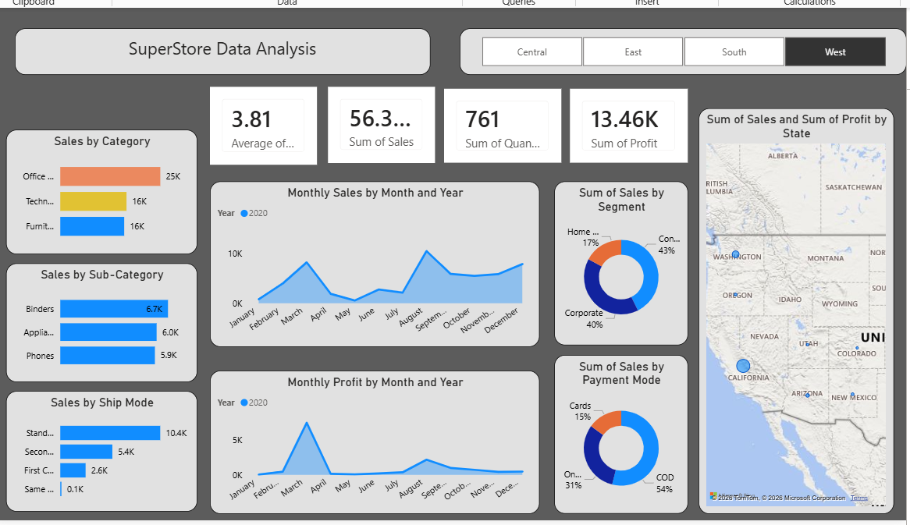
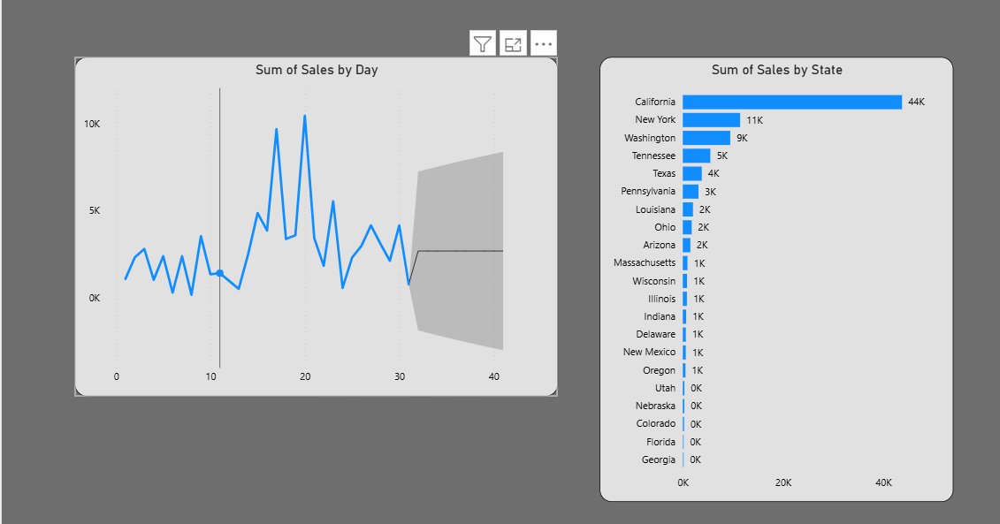

# SuperStore Data Analysis — Power BI Dashboard

An interactive Power BI dashboard analyzing sales, profit, and customer behavior for the SuperStore dataset. The report covers category-level performance, regional trends, shipping mode efficiency, payment behavior, and state-wise sales forecasting.



## 📊 Overview

This project explores SuperStore's retail sales data to uncover insights around:
- Which product categories and sub-categories drive the most revenue
- How sales and profit trend across the year
- Regional and state-level performance (with an interactive US map)
- Customer segment and payment mode contribution to sales
- Shipping mode preferences and their sales impact
- Day-level sales forecasting

## 🛠️ Tools Used

- **Power BI Desktop** — data modeling, DAX, and report design
- **DAX** — calculated measures (Sum of Sales, Sum of Profit, Average metrics, etc.)
- **Power BI Forecasting** — built-in analytics for day-level sales trend projection

## 📁 Project Structure

```
superstore-project/
├── README.md
├── dashboard.pbix              # Power BI report file
├── screenshots/
│   ├── dashboard-overview.png  # Main dashboard page
│   └── sales-by-state-trend.png# Sales trend & state breakdown page
└── docs/
    ├── dax-measures.md         # Key DAX measures used
    └── data-model.md           # Data model / table notes
```

## 📈 Dashboard Pages

### 1. Main Overview (filterable by Region: Central / East / South / West)

- **KPI Cards:** Average metric, Sum of Sales, Sum of Quantity, Sum of Profit
- **Sales by Category:** Office Supplies, Technology, Furniture
- **Sales by Sub-Category:** Top sub-categories by revenue (Binders, Appliances, Phones, etc.)
- **Sales by Ship Mode:** Standard, Second, First, Same Day
- **Monthly Sales by Month and Year:** Line chart of sales trend across 2020
- **Monthly Profit by Month and Year:** Line chart of profit trend across 2020
- **Sum of Sales by Segment:** Consumer, Corporate, Home Office (donut chart)
- **Sum of Sales by Payment Mode:** COD, Online, Cards (donut chart)
- **Sum of Sales and Sum of Profit by State:** Interactive US map

### 2. Sales Trend & State Breakdown



- **Sum of Sales by Day:** Day-level sales trend with a built-in forecast band projecting future sales
- **Sum of Sales by State:** Ranked bar chart of all states by total sales (California leading at 44K, followed by New York and Washington)

## 🔑 Key Insights

- **Office Supplies** is the top-performing category by sales (~25K), ahead of Technology and Furniture (~16K each)
- **Standard shipping** accounts for the largest share of orders (10.4K), while Same Day shipping is minimal (0.1K)
- **Consumer segment** drives the largest share of sales (43%), closely followed by Corporate (40%)
- **Cash on Delivery (COD)** is the dominant payment mode at 54% of sales
- **California** is by far the top-selling state (44K), more than 4x the next closest state (New York, 11K)
- Sales show clear month-over-month seasonality, with peaks around March and August

## 🚀 How to View

1. Download `dashboard.pbix`
2. Open in [Power BI Desktop](https://powerbi.microsoft.com/desktop/) (free)
3. Use the region buttons (Central / East / South / West) at the top to filter the main page
4. Navigate between report pages using the tabs at the bottom of Power BI Desktop

> Note: If the underlying dataset isn't included in this repo, you may need to point Power BI to your own copy of the SuperStore dataset and refresh the data model.

## 👤 Author

Yogesh — [LinkedIn](#) · [Portfolio](#)
